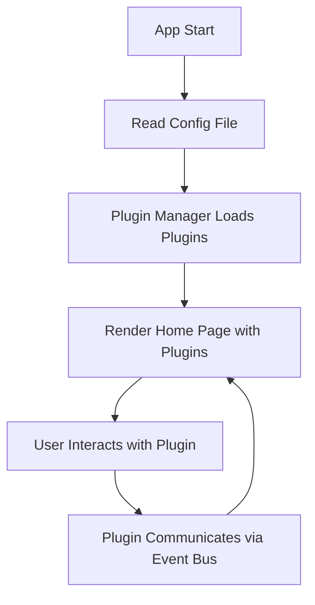

To convert **RADAR-Questionnaire** into a **plugin/widget-based architecture** for maximum flexibility, performance, and maintainability, you should adopt a modular, dynamic, and configuration-driven approach. Below is a detailed plan and recommended architecture, considering your requirements and best practices for cross-platform mobile development.

---

## 1. **Framework Selection**

### **Options**
- **Flutter**: Excellent for plugin/widget architecture, high performance, beautiful UI, strong community, and easy dynamic UI rendering.
- **React Native**: Good for modularity, large ecosystem, and dynamic UI, but less performant for complex UIs than Flutter.
- **Ionic + Angular/React**: Familiar, but less flexible for true dynamic plugin systems and may have performance trade-offs.

**Recommendation:**  
**Flutter** is the best fit for a highly dynamic, plugin-based, and visually rich app. It supports runtime widget loading, strong encapsulation, and easy integration with native code (for HealthKit, wearables, etc.).

---

## 2. **High-Level Architecture**

### **Core Concepts**
- **Plugin/Widget**: A self-contained module with its own UI, logic, and configuration.
- **Plugin Manager**: Loads, configures, and renders plugins at runtime based on configuration files.
- **Configuration Files**: JSON/YAML files describing which plugins to load, their order, settings, and data sources.
- **Event Bus/State Management**: For communication between plugins and the core app (e.g., Bloc, Provider, Redux in Flutter).
- **Dynamic UI Renderer**: Renders UI based on configuration, allowing for plug-and-play screens.

---

## 3. **Detailed Steps**

### **A. Define Plugin Interface**

- Each plugin implements a common interface (e.g., `IPluginWidget` in Dart/Flutter).
- Interface includes:
  - `Widget build(BuildContext context, PluginConfig config)`
  - `Future<void> initialize()`
  - `dispose()`
  - Optional: hooks for lifecycle, data, and events.

### **B. Plugin Registration and Discovery**

- Plugins are registered with a **Plugin Manager**.
- At runtime, the manager reads the configuration and instantiates the required plugins.
- Plugins can be loaded from:
  - Local codebase (for performance)
  - Remote sources (for updates without app redeploy, using dynamic code loading or remote config)

### **C. Configuration-Driven UI**

- Home, Settings, Calendar, and other pages are described in configuration files.
- Each page lists the plugins/widgets to render, their order, and their configuration.
- Example (YAML/JSON):
  ```yaml
  home:
    widgets:
      - type: "TaskList"
        config: { ... }
      - type: "DeviceStatus"
        config: { ... }
      - type: "CustomBanner"
        config: { ... }
  ```

### **D. Plugin Communication**

- Use an **Event Bus** or **State Management** system for plugins to communicate (e.g., to update UI, share data, trigger navigation).
- Plugins should be loosely coupled and communicate via events or shared state.

### **E. Dynamic Loading and Hot Swapping**

- Support for adding/removing plugins at runtime via config changes.
- Use lazy loading for performance (only load plugins when needed).

### **F. Native Integrations**

- Plugins for HealthKit, wearables, etc., encapsulate native code and expose a unified interface to the app.
- Use platform channels (Flutter) or bridges (React Native) for native communication.

### **G. Theming and Styling**

- Support dynamic theming via configuration.
- Each plugin can define its own style or inherit from global themes.

---

## 4. **Example Plugin Interface (Flutter/Dart)**

```dart
abstract class IPluginWidget {
  Widget build(BuildContext context, PluginConfig config);
  Future<void> initialize();
  void dispose();
}
```

---

## 5. **Plugin Manager Example (Flutter/Dart)**

```dart
class PluginManager {
  final Map<String, IPluginWidget> _registeredPlugins = {};

  void register(String type, IPluginWidget plugin) {
    _registeredPlugins[type] = plugin;
  }

  Widget loadPlugin(String type, PluginConfig config) {
    final plugin = _registeredPlugins[type];
    if (plugin != null) {
      return plugin.build(context, config);
    }
    return Placeholder();
  }
}
```

---

## 6. **Dynamic UI Rendering**

- The main app reads the config and builds the UI tree by instantiating plugins as specified.
- This allows for full plug-and-play capability.

---

## 7. **Best Practices**

- **Encapsulation**: Each plugin should be self-contained.
- **Loose Coupling**: Use interfaces and event-driven communication.
- **Performance**: Lazy load plugins, avoid unnecessary rebuilds.
- **Security**: Validate and sandbox plugins, especially if loaded remotely.
- **Testing**: Each plugin should be independently testable.

---

## 8. **Migration Steps**

1. **Audit** current app features and break them into plugin candidates.
2. **Design** the plugin interface and manager.
3. **Refactor** existing features into plugins.
4. **Implement** configuration-driven UI.
5. **Test** dynamic loading, plugin communication, and performance.
6. **Document** plugin development for future extensibility.

---

## 9. **Sample Home Page Flow (Diagram)**



---

## 10. **Summary Table**

| Aspect                | Recommendation                |
|-----------------------|------------------------------|
| Framework             | Flutter                      |
| Plugin Interface      | Abstract class/interface     |
| UI Rendering          | Config-driven, dynamic       |
| Communication         | Event bus/state management   |
| Native Integration    | Platform channels            |
| Theming               | Dynamic, per-plugin support  |
| Performance           | Lazy loading, isolation      |

---

## 11. **References**

- [Flutter Plugin Architecture](https://docs.flutter.dev/development/packages-and-plugins/using-packages)
- [Dynamic Widget Rendering in Flutter](https://pub.dev/packages/dynamic_widget)
- [RADAR-base Platform](https://radar-base.org/)

---

**This approach will give you a highly flexible, maintainable, and future-proof mobile app, where new features and UIs can be added or updated simply by creating new plugins and updating configuration files—no need to redeploy the app for most changes.**