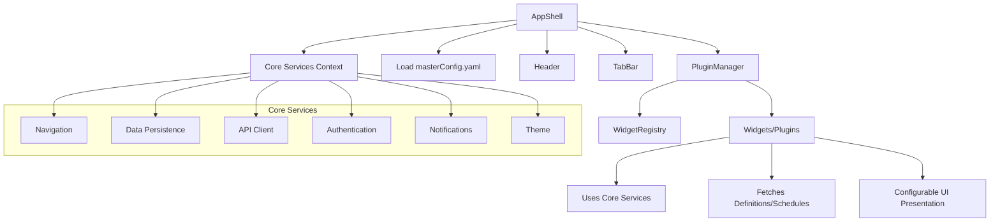

Absolutely! Here’s a **comprehensive, final plan** for your plugin/widget-based architecture in React, integrating all your requirements—including the Core Services available via the application shell. This plan includes:

- **Architecture Overview**
- **Core Services Design**
- **Detailed YAML Config Spec**
- **React Code Skeletons**
- **Directory Structure**
- **Mermaid Diagram**

---

# 1. **Architecture Overview**

- **App Shell**: Provides Core Services (via React Context) and loads the UI dynamically from a master YAML config.
- **Core Services**: Navigation, Data Persistence, API Client, Authentication, Notifications, Theme.
- **Plugin/Widget System**: Feature-level modules (e.g., Questionnaire, Vitals, Sleep) that consume Core Services and render based on config.
- **Config-Driven UI**: All screens, layouts, and widget presentations are defined in YAML config files.
- **Widget Library**: A catalog of reusable, plug-and-play feature widgets.

---

# 2. **Core Services (React Context)**

Each service is provided via a React Context, accessible to all plugins/widgets.

- **NavigationService**: Handles navigation and deep linking.
- **DataService**: Secure local storage and retrieval.
- **ApiService**: HTTP client for backend communication.
- **AuthService**: User session and authorization.
- **NotificationService**: Push/local notifications.
- **ThemeService**: Theming, color schemes, fonts, etc.

---

# 3. **YAML Config Spec**

### **Example: `masterConfig.yaml`**

```yaml
header:
  title: "RADAR-CNS"
  showSettings: true

tabs:
  - label: "Home"
    icon: "home"
    screen: "homeScreen"
  - label: "Calendar"
    icon: "calendar"
    screen: "calendarScreen"

screens:
  homeScreen:
    blocks:
      - type: "QuestionnaireWidget"
        config:
          presentation: "card"
          questionnaireId: "PHQ8"
      - type: "VitalsWidget"
        config:
          presentation: "miniChart"
          vitalType: "OxygenSaturation"
      - type: "DeviceStatusWidget"
        config:
          presentation: "card"
  calendarScreen:
    blocks:
      - type: "CalendarWidget"
        config: {}

widgets:
  - type: "QuestionnaireWidget"
    description: "Collects survey responses"
    presentations: ["card", "list", "fullPage"]
  - type: "VitalsWidget"
    description: "Shows health vitals"
    presentations: ["miniChart", "detailedChart"]
  - type: "DeviceStatusWidget"
    description: "Shows device connection status"
    presentations: ["card"]
  - type: "CalendarWidget"
    description: "Shows scheduled tasks"
    presentations: ["calendar"]
```

---

# 4. **React Code Skeletons**

## **A. Core Services Context**

```typescript
// src/core/CoreServicesContext.tsx
import React, { createContext, useContext } from "react";

export interface CoreServices {
  navigation: NavigationService;
  data: DataService;
  api: ApiService;
  auth: AuthService;
  notifications: NotificationService;
  theme: ThemeService;
}

export const CoreServicesContext = createContext<CoreServices | null>(null);

export const useCoreServices = () => {
  const ctx = useContext(CoreServicesContext);
  if (!ctx) throw new Error("CoreServicesContext not found");
  return ctx;
};
```

## **B. App Shell**

```typescript
// src/AppShell.tsx
import React from "react";
import { CoreServicesContext, CoreServices } from "./core/CoreServicesContext";
import { PluginManager } from "./components/PluginManager";
import { loadConfig } from "./utils/configLoader";

export const AppShell: React.FC = () => {
  const coreServices: CoreServices = { /* ...initialize services... */ };
  const config = loadConfig(); // Load YAML config

  return (
    <CoreServicesContext.Provider value={coreServices}>
      <Header config={config.header} />
      <PluginManager config={config} />
      <TabBar tabs={config.tabs} />
    </CoreServicesContext.Provider>
  );
};
```

## **C. Plugin/Widget Interface**

```typescript
// src/widgets/WidgetTypes.ts
import { CoreServices } from "../core/CoreServicesContext";

export interface WidgetProps {
  config: any;
  coreServices: CoreServices;
  onNavigate?: (widgetType: string, detailConfig: any) => void;
}
export type WidgetComponent = React.FC<WidgetProps>;
```

## **D. Plugin Manager**

```typescript
// src/components/PluginManager.tsx
import React from "react";
import { useCoreServices } from "../core/CoreServicesContext";
import { widgetRegistry } from "../widgets/widgetRegistry";

export const PluginManager: React.FC<{ config: any }> = ({ config }) => {
  const coreServices = useCoreServices();
  const currentScreen = config.tabs[0].screen; // Example: active tab logic

  return (
    <>
      {config.screens[currentScreen].blocks.map((block: any, idx: number) => {
        const Widget = widgetRegistry[block.type];
        if (!Widget) return null;
        return (
          <Widget
            key={idx}
            config={block.config}
            coreServices={coreServices}
            onNavigate={/* navigation handler */}
          />
        );
      })}
    </>
  );
};
```

## **E. Example Widget (QuestionnaireWidget)**

```typescript
// src/widgets/QuestionnaireWidget.tsx
import React from "react";
import { WidgetProps } from "./WidgetTypes";

export const QuestionnaireWidget: React.FC<WidgetProps> = ({ config, coreServices, onNavigate }) => {
  // Use coreServices.api, coreServices.data, etc.
  // Fetch questionnaire definition using config.questionnaireId
  // Render based on config.presentation
  // Use coreServices.theme for styling

  return (
    <div onClick={() => onNavigate?.("QuestionnaireWidget", { ...config, presentation: "fullPage" })}>
      {/* Render summary card, list, or full page based on config.presentation */}
      {/* Example: */}
      {config.presentation === "card" && <div>Card View for {config.questionnaireId}</div>}
      {config.presentation === "fullPage" && <div>Full Questionnaire Page</div>}
    </div>
  );
};
```

## **F. Widget Registry**

```typescript
// src/widgets/widgetRegistry.ts
import { QuestionnaireWidget } from "./QuestionnaireWidget";
import { VitalsWidget } from "./VitalsWidget";
import { DeviceStatusWidget } from "./DeviceStatusWidget";
import { CalendarWidget } from "./CalendarWidget";

export const widgetRegistry = {
  QuestionnaireWidget,
  VitalsWidget,
  DeviceStatusWidget,
  CalendarWidget,
};
```

---

# 5. **Directory Structure**

```
/src
  /core
    CoreServicesContext.tsx
    NavigationService.ts
    DataService.ts
    ApiService.ts
    AuthService.ts
    NotificationService.ts
    ThemeService.ts
  /widgets
    QuestionnaireWidget.tsx
    VitalsWidget.tsx
    DeviceStatusWidget.tsx
    CalendarWidget.tsx
    WidgetTypes.ts
    widgetRegistry.ts
  /components
    PluginManager.tsx
    Header.tsx
    TabBar.tsx
  /config
    masterConfig.yaml
  /definitions
    questionnaires.json
    vitals.json
  /schedules
    schedules.json
  AppShell.tsx
  index.tsx
```

---

# 6. **Mermaid Diagram**



---

# 7. **How to Proceed**

1. **Implement Core Services** as React Context providers.
2. **Define Widget Interface** and create a registry for all widgets.
3. **Build PluginManager** to dynamically load and render widgets from config.
4. **Design YAML Config** for screens, tabs, and widget presentations.
5. **Create Widget Library** with feature-level widgets (Questionnaire, Vitals, etc.).
6. **Ensure Widgets Use Core Services** for navigation, data, API, etc.
7. **Build Widget Catalog UI** for plug-and-play experience (optional, for admin/researcher users).

---

## **This architecture gives you:**
- **Maximum flexibility** (config-driven, plug-and-play widgets)
- **Strong separation of concerns** (core services, widgets, config, data)
- **Scalability** (easy to add new widgets/features)
- **Consistent access to shared services** (via context)
- **Customizable UI/UX** (theme service, presentation config)

---

**Let me know if you want a more detailed code sample for any specific service, widget, or the config loader!**