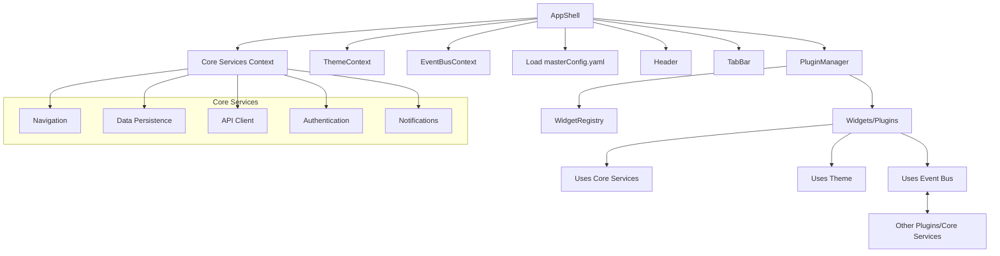

Absolutely! Here’s how to **update the plan** to include:

1. **Theme configuration in the master config** (so the look & feel is fully dynamic and centrally managed).
2. **Event bus** (or similar pattern) for communication between plugins/widgets and with core services.

---

# 1. **Theme Configuration in Master Config**

Add a `theme` section to your YAML config. This can include colors, fonts, spacing, etc., and is loaded at app startup. The ThemeService will read from this config and provide theme values via context.

**Example:**

```yaml
theme:
  primaryColor: "#1976d2"
  secondaryColor: "#424242"
  backgroundColor: "#f5f5f5"
  cardRadius: 12
  fontFamily: "Inter, Arial, sans-serif"
  fontSize: 16
  button:
    borderRadius: 8
    color: "#1976d2"
    textColor: "#fff"
  chart:
    barColor: "#1976d2"
    axisColor: "#888"
```

---

# 2. **Event Bus for Plugin Communication**

- Use a lightweight event bus (e.g., [mitt](https://github.com/developit/mitt), [eventemitter3](https://github.com/primus/eventemitter3)), or roll your own with React Context.
- The event bus is provided via context, just like core services.
- Plugins/widgets can **emit** and **listen** for events (e.g., "taskCompleted", "navigate", "dataUpdated").
- Core services can also emit/listen, enabling two-way communication.

---

# 3. **Updated YAML Config Example**

```yaml
theme:
  primaryColor: "#1976d2"
  secondaryColor: "#424242"
  backgroundColor: "#f5f5f5"
  fontFamily: "Inter, Arial, sans-serif"
  fontSize: 16

header:
  title: "RADAR-CNS"
  showSettings: true

tabs:
  - label: "Home"
    icon: "home"
    screen: "homeScreen"
  - label: "Calendar"
    icon: "calendar"
    screen: "calendarScreen"

screens:
  homeScreen:
    blocks:
      - type: "QuestionnaireWidget"
        config:
          presentation: "card"
          questionnaireId: "PHQ8"
      - type: "VitalsWidget"
        config:
          presentation: "miniChart"
          vitalType: "OxygenSaturation"
```

---

# 4. **React Code Skeletons (with Theme & Event Bus)**

## **A. Theme Service & Context**

```typescript
// src/core/ThemeService.ts
import React, { createContext, useContext } from "react";

export interface Theme {
  primaryColor: string;
  secondaryColor: string;
  backgroundColor: string;
  fontFamily: string;
  fontSize: number;
  // ...other theme fields
}

export const ThemeContext = createContext<Theme | null>(null);

export const useTheme = () => {
  const ctx = useContext(ThemeContext);
  if (!ctx) throw new Error("ThemeContext not found");
  return ctx;
};
```

## **B. Event Bus Service & Context**

```typescript
// src/core/EventBus.ts
import mitt, { Emitter } from "mitt";
import React, { createContext, useContext } from "react";

type Events = {
  [event: string]: any;
};

export const eventBus: Emitter<Events> = mitt();

export const EventBusContext = createContext<Emitter<Events> | null>(null);

export const useEventBus = () => {
  const ctx = useContext(EventBusContext);
  if (!ctx) throw new Error("EventBusContext not found");
  return ctx;
};
```

## **C. App Shell (with Theme and Event Bus)**

```typescript
// src/AppShell.tsx
import React from "react";
import { CoreServicesContext, CoreServices } from "./core/CoreServicesContext";
import { ThemeContext } from "./core/ThemeService";
import { EventBusContext, eventBus } from "./core/EventBus";
import { PluginManager } from "./components/PluginManager";
import { loadConfig } from "./utils/configLoader";

export const AppShell: React.FC = () => {
  const config = loadConfig(); // Loads YAML config
  const coreServices: CoreServices = { /* ...initialize services... */ };
  const theme = config.theme;

  return (
    <CoreServicesContext.Provider value={coreServices}>
      <ThemeContext.Provider value={theme}>
        <EventBusContext.Provider value={eventBus}>
          <Header config={config.header} />
          <PluginManager config={config} />
          <TabBar tabs={config.tabs} />
        </EventBusContext.Provider>
      </ThemeContext.Provider>
    </CoreServicesContext.Provider>
  );
};
```

## **D. Widget Example (Using Theme & Event Bus)**

```typescript
// src/widgets/QuestionnaireWidget.tsx
import React, { useEffect } from "react";
import { WidgetProps } from "./WidgetTypes";
import { useTheme } from "../core/ThemeService";
import { useEventBus } from "../core/EventBus";

export const QuestionnaireWidget: React.FC<WidgetProps> = ({ config, coreServices, onNavigate }) => {
  const theme = useTheme();
  const eventBus = useEventBus();

  useEffect(() => {
    // Listen for events
    const handler = (data: any) => {
      // handle event
    };
    eventBus.on("taskCompleted", handler);
    return () => eventBus.off("taskCompleted", handler);
  }, [eventBus]);

  const handleClick = () => {
    // Emit event
    eventBus.emit("navigate", { widget: "QuestionnaireWidget", config: { ...config, presentation: "fullPage" } });
    onNavigate?.("QuestionnaireWidget", { ...config, presentation: "fullPage" });
  };

  return (
    <div
      style={{
        background: theme.primaryColor,
        fontFamily: theme.fontFamily,
        borderRadius: 12,
        padding: 16,
        color: "#fff"
      }}
      onClick={handleClick}
    >
      {/* Render summary card, list, or full page based on config.presentation */}
      {config.presentation === "card" && <div>Card View for {config.questionnaireId}</div>}
      {config.presentation === "fullPage" && <div>Full Questionnaire Page</div>}
    </div>
  );
};
```

---

# 5. **Mermaid Diagram (Updated)**



---

# 6. **Summary Table**

| Feature                | Implementation Approach                                  |
|------------------------|---------------------------------------------------------|
| Theme                  | Configured in YAML, provided via ThemeContext           |
| Event Bus              | Provided via EventBusContext, plugins can emit/listen   |
| Plugin Communication   | Event bus for decoupled, flexible messaging             |
| UI Consistency         | All widgets use theme from context                      |
| Dynamic UI             | All driven by master config and widget library          |

---

**This approach ensures:**
- **Centralized, dynamic theming** (change look & feel via config)
- **Decoupled, flexible communication** between plugins and core services (event bus)
- **Maximum extensibility and maintainability**

---

Let me know if you want a more detailed code sample for a specific service, event bus usage, or theme integration!